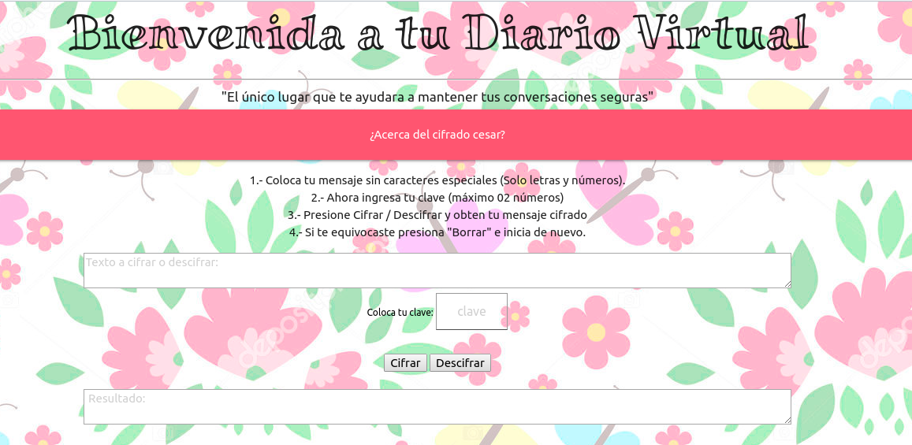
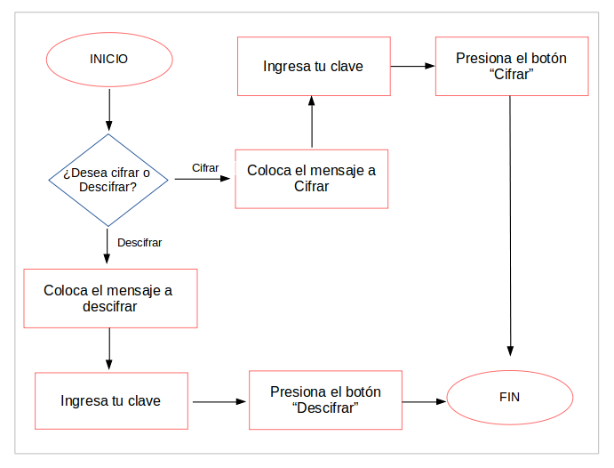

# Tu Diario Virtual

- Es una web simple, diseñada para las adolescentes que quieren mantener en "secreto" sus vivencias pero a la vez dejarlas plasmadas en su diario para releerlas y recordarlas pasado un tiempo. Podrían tener hermanos o cualquier otra persona que en cualquier momento se verán tentados a tomar su diario y simplemente leerlo. Con "Tu Diario Virtual" la adolescente puede cifrar sus mensajes, escribirlos en su diario físico y de esta manera puede dejarlo de forma visible en su habitación sin que otras personas puedan descubrir lo que dice.
- Por otro lado, la misma puede ser utilizada de forma fácil y sencilla ya que solo requiere conocimientos muy básicos en la utilización de paginas web. En cuanto al diseño se adaptaron los tonos rosas debido a que es un color relajante que influye en los sentimientos positivamente, invitándolos a ser amables, suaves y profundos. Su significado esta asociado a sentir cariño, amor y protección que es precisamente lo que se quiere conseguir para captar la atención de nuestro publico.
- Las instrucciones fueron escritas a través de una sintaxis muy fácil de entender, de manera clara y sencilla y sobre todo en un texto breve para no perder la atención de nuestras usuarias quienes a esta edad probablemente no quieren "perder" tiempo en largas lecturas. El tipo de letra del titulo principal fue el "Miltonian" para darle un toque especial de estilo informal y divertido inclinado a simular la escritura manual que suele utilizarse al momento de redactar un diario, en el resto de la pagina se utilizo una fuente de "monospace" lo cual da un aspecto visual mas ordenado.
- El método utilizado para cifrar y descifrar se realiza según el algoritmo del cifrado de Cesar. Si alguna de nuestras usuarias quisieran más información sobre el cifrado de Cesar se anexó un enlace en la parte superior que abrira una nueva interfaz que la llevara al siguiente link: (https://en.wikipedia.org/wiki/Caesar_cipher).
- La interfaz esta diseñada para cifrar y descifrar los caracteres más utilizados como letras mayúsculas, minúsculas y números, los caracteres especiales como la "ñ" o "Ñ" entre otros, no fueron tomados en cuenta.

- Tu Diario Virtual esta diseñada de la siguiente forma:

- Como se dijo anteriormente los pasos a seguir para la optima utilización de la pagina es tan sencilla como se muestra:

#### La experiencia con la interfaz se puede resumir en:

1. Colocar el texto que desea cifrar o descifrar.
2. Elegir la clave la cual seria el desplazamiento que le indica cuántas posiciones queremos que el cifrado desplace cada carácter.
3. Presionar el botón "Cifrar" o "Descifrar" según sea el caso.
4. Ver el resultado del mensaje cifrado o descifrado.

#### Mejoras
- Actualmente las redes sociales forman parte de la vida de casi el 100% de las personas en edad de adolescente por lo cual se propone mejorar la interacción de nuestras usuarias al colocar algunos links para que a través de estos se pueda copiar el mensaje cifrado a cada una de las redes sociales y estas puedan también enviar mensajes cifrados a sus amigos.
- Todos sabemos que la idea principal de un diario es realizarlo de forma manuscrita, sin embargo, puede haber algunas usuarias que quisieran llevarlo a través de un blog de notas para lo cual se podría diseñar la manera de enviar el texto al e-mail o descargarlo de forma local. 

### Planificación del proyecto

- La herramienta utilizada para la planificación del proyecto se realizo a tráves de "Trello" puedes observarlo dando clikc en el link: https://trello.com/b/3D5zZXUo/proyecto-1-m%C3%A9todo-cesar

